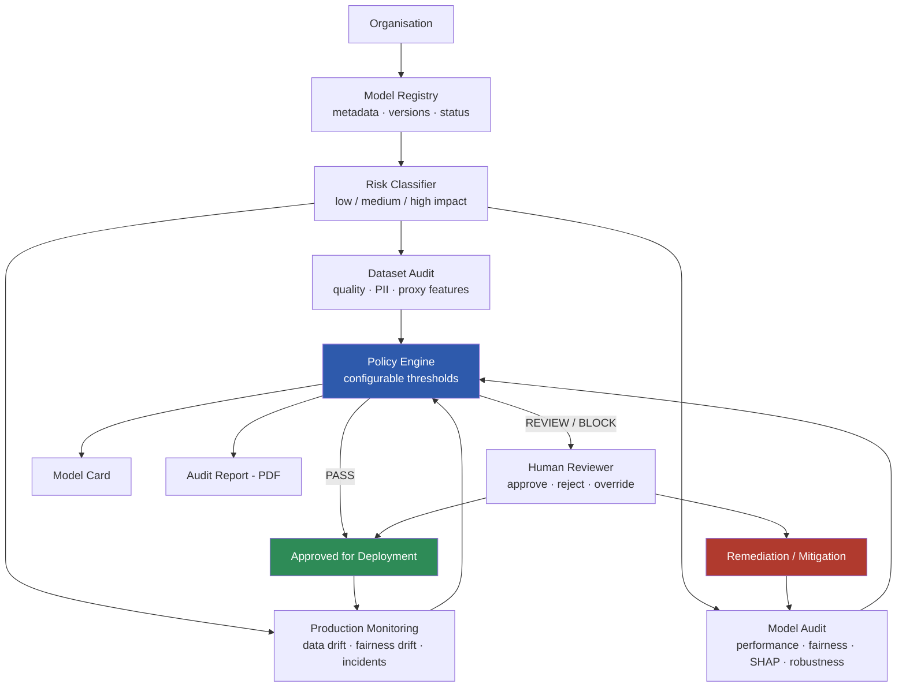
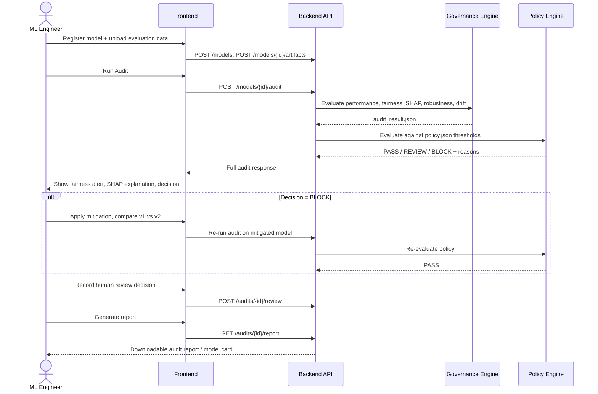

<div align="center">

# TrustLayer

### Continuous Responsible AI Assurance, Policy Enforcement & Audit Platform

**Smart India Hackathon 2026 · Artificial Intelligence Theme**
*Responsible AI Governance Platform*

[]()
[]()
[]()
[]()
[]()

*"Most governance tools tell you what went wrong after evaluation. TrustLayer turns Responsible AI requirements into executable policies that automatically test, block, monitor and re-audit models throughout their lifecycle."*

[Problem](#-the-problem) ·
[Solution](#-the-solution) ·
[Architecture](#-system-architecture) ·
[Features](#-key-features) ·
[Tech Stack](#-tech-stack) ·
[Getting Started](#-getting-started) ·
[API](#-api-reference) ·
[Team](#-team)

</div>

---

## 📌 The Problem

Organisations deploying AI need mechanisms to ensure **transparency, fairness, explainability and compliance** with emerging AI regulations — NIST AI RMF, ISO/IEC 42001, the EU AI Act, and India's IndiaAI Governance Guidelines and DPDP Act.

In practice, this evidence is scattered: an ML team's spreadsheet, a compliance team's Word doc, a separate monitoring dashboard, and an auditor emailing everyone for proof. There is no single place that continuously answers:

> Is this model accurate, fair, explainable, safe, stable, privacy-aware and properly documented — **and can we prove it?**

## 💡 The Solution

**TrustLayer** is a governance layer that sits between "a model exists" and "a model is in production." It automatically audits a model for **performance, fairness, explainability, robustness and drift**, evaluates the results against **configurable organisational policy**, and returns a deterministic **PASS / REVIEW / BLOCK** decision — with an audit-ready report and model card at every step.

```
MODEL CREATED → AUTOMATED RED-TEAM → POLICY ENGINE → PASS?
                                                        ├─ YES → DEPLOY → MONITOR → drift? → RE-AUDIT
                                                        └─ NO  → BLOCK  → REMEDIATE / MITIGATE → RE-AUDIT
```

This is governance treated as a **CI/CD-style gate**, not a one-off report — the platform's core differentiator versus a static "responsible AI dashboard."

> **Scope note:** the MVP supports scikit-learn-style binary classifiers (Logistic Regression, Random Forest, XGBoost). TrustLayer does not issue legal-compliance certifications or a single "ethics score" — it surfaces evidence and review signals for human decision-makers, and maps that evidence to recognised frameworks (NIST AI RMF, ISO/IEC 42001) as **evidence support, not certification**.

## ✨ Key Features

| Module | What it does |
|---|---|
| 🗂️ **Model Registry** | Register a model's name, version, owner, use case, target column, sensitive attributes and status. |
| 📊 **Performance Audit** | Accuracy, precision, recall, F1, ROC-AUC and confusion matrix. |
| ⚖️ **Fairness Audit** | Per-group selection rates, demographic parity gap, disparate-impact ratio, TPR / equal-opportunity gap, and **automatic intersectional subgroup discovery** (e.g. gender × age). |
| 🔍 **Explainability** | Global SHAP feature importance + local SHAP explanation for an individual prediction, with proxy-feature flags. |
| 🧪 **Robustness & Monitoring** | Missing-value / noise perturbation tests, data drift and fairness drift on simulated production batches. |
| 🚦 **Policy Engine** | Configurable thresholds → deterministic **PASS / REVIEW / BLOCK** with explicit failed-rule reasons. |
| 🔁 **Mitigation Comparison** | Side-by-side before/after view of a biased model vs. a mitigated model — makes the fairness/performance trade-off visible. |
| 📄 **Audit Trail & Reporting** | Every audit persists model version, findings, reviewer decision and timestamp; generates a downloadable audit report / model card. |

## 🏗️ System Architecture



### Service breakdown

| Layer | Responsibility |
|---|---|
| **Backend / API / Registry** | FastAPI service, DB schema, model registration, artifact ingestion, orchestration of governance engines, audit persistence, report payloads. |
| **Fairness, Explainability & Mitigation engine** | Performance + fairness metrics, subgroup & proxy analysis, SHAP global/local explanations, before/after mitigation comparison. |
| **Monitoring, Robustness & Policy engine** | Perturbation / missing-data robustness tests, data & fairness drift, configurable policy rule evaluator. |
| **Frontend / Reporting** | Dashboard, audit views, monitoring & policy visualisations, report layout, demo flow. |

### 🎬 End-to-end demo flow



## 🧰 Tech Stack

| Layer | Technology |
|---|---|
| Frontend | React, Recharts / Plotly |
| Backend / API | FastAPI (Python) |
| Database | PostgreSQL (SQLite for the 48-hour build track) |
| ML / evaluation | scikit-learn, pandas, NumPy |
| Fairness metrics | Fairlearn or custom implementations |
| Explainability | SHAP |
| Drift detection | Evidently or custom KS / Wasserstein / PSI |
| Reporting | HTML → PDF |
| Containerisation | Docker |

## 📁 Project Structure

```
trustlayer/
├── backend/                  # FastAPI app, DB models, orchestration, API routes
│   ├── app/
│   │   ├── routers/          # /models, /audit, /policies, /reports
│   │   ├── models/           # SQLAlchemy / Pydantic schemas
│   │   └── services/         # audit orchestration, report generation
│   └── requirements.txt
├── governance_engine/        # Fairness, explainability, mitigation (Python package)
│   ├── performance.py
│   ├── fairness.py
│   ├── explainability.py
│   └── mitigation.py
├── monitoring_policy/        # Robustness, drift, policy evaluator
│   ├── robustness.py
│   ├── drift.py
│   └── policy_engine.py
├── frontend/                 # React app
│   └── src/
│       ├── pages/            # Dashboard, Models, Audit, Monitoring, Policies, Reports
│       └── components/
├── data_models/               # Demo dataset, biased_model.pkl, improved_model.pkl, metadata.json
├── demo_assets/               # Deterministic fixtures used in the live demo
└── docs/                      # PRD, architecture notes, interface contracts
```

## 🔗 Shared Interface Contract

All modules are built in parallel against this frozen contract so no team member blocks another.

<details>
<summary><strong>Example audit response (click to expand)</strong></summary>

```json
{
  "model": { "name": "LoanApproval_v1", "version": "1.0" },
  "performance": { "accuracy": 0.91, "precision": 0.89, "recall": 0.88, "f1": 0.88 },
  "fairness": {
    "sensitive_attribute": "gender",
    "selection_rates": { "group_A": 0.78, "group_B": 0.52 },
    "demographic_parity_gap": 0.26,
    "disparate_impact_ratio": 0.67,
    "tpr_gap": 0.17,
    "status": "FAIL"
  },
  "explainability": { "status": "PASS", "global_features": [], "local_explanation": [] },
  "drift": { "status": "NOT_RUN", "features": [] },
  "decision": { "status": "BLOCK", "reasons": ["Fairness policy failed: parity gap 0.26 > configured 0.15"] }
}
```

</details>

**Demo dataset schema:** `age, gender, income, credit_score, debt_ratio, employment_years, region, approved`

## 🚀 Getting Started

### Prerequisites
- Python 3.10+
- Node.js 18+
- Docker (optional, for containerised run)

### Backend

```bash
cd backend
python -m venv venv && source venv/bin/activate
pip install -r requirements.txt
uvicorn app.main:app --reload --port 8000
```

### Frontend

```bash
cd frontend
npm install
npm run dev
```

### Load demo data

```bash
python data_models/seed_demo.py   # loads biased_model.pkl, improved_model.pkl, evaluation.csv
```

Visit `http://localhost:5173`, register **LoanApproval-v1**, and click **Run Audit** to walk through the full governance flow.

## 📡 API Reference

| Endpoint | Purpose |
|---|---|
| `POST /models` | Register model metadata |
| `POST /models/{id}/artifacts` | Attach model/evaluation artifacts or references |
| `POST /models/{id}/audit` | Run the complete audit orchestration |
| `GET /models/{id}/audits/{audit_id}` | Return the complete `AuditResult` JSON |
| `POST /audits/{audit_id}/review` | Human approve / reject / review decision |
| `POST /policies` | Create or update organisation policy thresholds |
| `GET /models/{id}/monitoring` | Return the drift / fairness-drift timeline |
| `GET /audits/{audit_id}/report` | Generate / retrieve the audit report |

## 🗺️ Roadmap

- [ ] Backend infrastructure setup
- [ ] Performance & fairness
- [ ] Explainability audit (SHAP)
- [ ] Configurable policy engine with PASS / REVIEW / BLOCK
- [ ] Mitigation before/after comparison
- [ ] Data & fairness drift monitoring
- [ ] Automated in-platform bias mitigation (reweighting, threshold adjustment)
- [ ] Support for PyTorch / TensorFlow / REST-served models
- [ ] Generative-AI / LLM governance module (hallucination, toxicity, prompt-injection, PII leakage)
- [ ] Role-based access control & multi-tenant organisations
- [ ] Native CI/CD pipeline integration

## 👥 Team

| Role | Ownership |
|---|---|
| Backend, Registry & Integration | FastAPI, DB schema, orchestration, audit persistence |
| Fairness auditing | Fairness & Bias metrics |
| Explainability and Mitigation | Shap &subgroup/proxy analysis |
| Monitoring, Robustness & Policy | Drift detection, robustness tests, policy engine |
| Frontend, Reporting & Demo | Dashboard, visualisations, report generation |
| Data & Demo Models (×2) | Demo dataset, biased/mitigated models, production batches |

## ⚖️ Responsible Use Statement

TrustLayer is a **decision-support and assurance tool**, not an automated arbiter of ethics or law. Fairness disparities are surfaced as **review signals requiring human judgement and context**, not automatic proof of discrimination. Framework mappings (NIST AI RMF, ISO/IEC 42001) represent **evidence support**, not legal certification.

## 📄 License

This project is released under the [MIT License](LICENSE).

---

<div align="center">
Built for Smart India Hackathon 2026 · Problem Statement: Responsible AI Governance Platform
</div>
